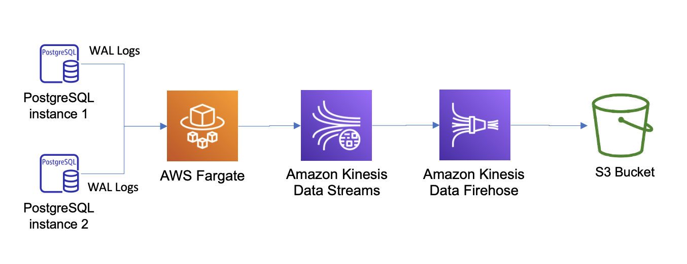

# PostgreSQL change replication to Data Lake using Fargate.



This project is based on the blog post below:
https://aws.amazon.com/blogs/database/stream-changes-from-amazon-rds-for-postgresql-using-amazon-kinesis-data-streams-and-aws-lambda/

I wanted to update the solution by using Fargate tasks for each DB you are replicating to S3. A python script is run per task to connect to the RDS Postgres RDS instance and start replication. The replication process sends data to a Kinesis Data Stream that has a Kinesis Firehose connected to it to land the data into S3 in a hive partitioned format.

## Getting Started

### Install AWS CDK Toolkit

You will also be using the [AWS CDK Toolkit](https://aws.amazon.com/cdk/) to deploy the appropriate resources in each account. You can follow the [Getting Started](https://docs.aws.amazon.com/cdk/latest/guide/getting_started.html) guide to install and become familiar with how to use it.

With the CDK installed the next thing to get started is to bootstrap each account for the CDK to handle uploading assets.
Use the CDK CLI to bootstrap all 3 accounts in the region of your choice. All scripts should work in regions supporting the resources used in the templates.

Use the `cdk bootstrap` command to bootstrap the AWS environment. The following examples illustrate bootstrapping of one and two environments, respectively. (Both use the same AWS account.) As shown in the second example, the aws:// prefix is optional when specifying an environment.

``` bash
cdk bootstrap aws://123456789012/us-east-1
cdk bootstrap 123456789012/us-east-1 123456789012/us-west-1
```

For purposes of this project we will bootstrap one region for each account like below, replacing the `*_ACCOUNT_NUMBER` with the respective account id for each and `REGION` with the region of your choice.:

``` bash
cdk bootstrap aws://LAKE_ACCOUNT_NUMBER/REGION --profile product

cdk bootstrap aws://CENTRAL_ACCOUNT_NUMBER/REGION --profile central

cdk bootstrap aws://CONSUMER_ACCOUNT_NUMBER/REGION --profile consumer
```

### Install Projen

[projen](https://github.com/projen/projen) synthesizes project configuration files such as package.json, tsconfig.json, .gitignore, GitHub Workflows, eslint, jest, etc from a well-typed definition written in JavaScript.

```bash
npm install projen

projen
```

This will install the projen library and when running `projen` it will create the configuration files needed by editing the .projenrc file. Once you have run this it will install the required libraries and aid in getting the appropriate cdk versioned libraries.

### Deploy!!!

With the CDK context file updated you are now ready to execute the scripts in each account. Follow the steps below:

``` bash
cdk deploy 
```

### What's in the box

Once the solution is deploy, a SageMaker notebook is created to launch the notebook in `scripts/accounts.ipynb` in the VPC of the solution to allow you to connect to the RDS database and insert records into the database to kick off the replication process.